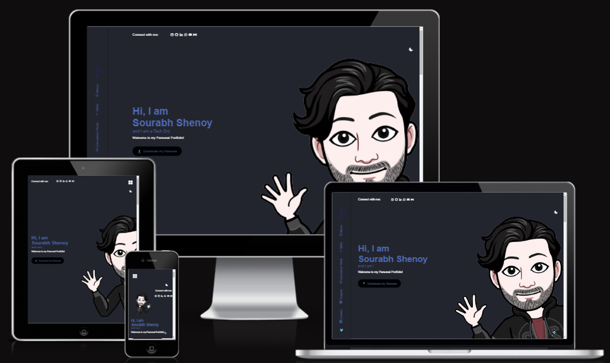
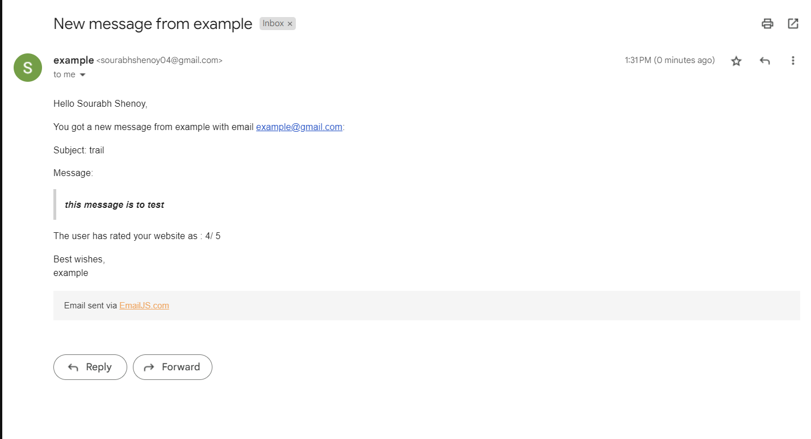

# Personal Portfolio

This project shows my professional experience, skills and accomplishments in an organized manner. This project includes special features to enhance the user experience such as light/dark mode for readability, animated icons to add interactivity and a preloader to prevent premature page exits. 

## 🛠 Tech Stack Used
- Language used: HTML, CSS, JavaScript
- Software used: Visual Studio Code
- Icons used: Boxicons
- Fonts used: Google Fonts
- Javascript libraries used : SwiperJS, EmailJS
- Free website hosting with the help of Vercel

## Features

- Switch between Light and Dark mode 
- Animated icons
- Preloader
- Responsive
- Custom Favicon (My logo is used)
  

## Preview of my website:

 

## Preview of how I receive messages on my personal Gmail through EmailJS:

 

